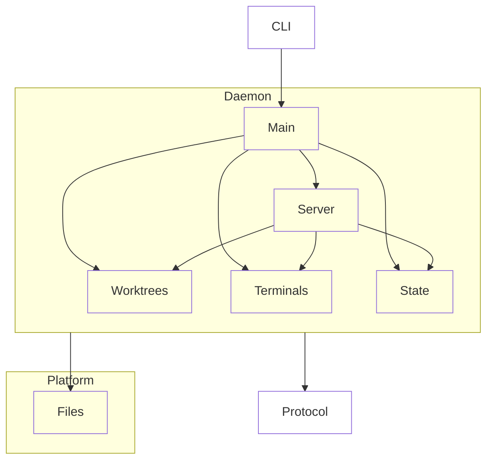

# Daemon

## Purpose & context

One per host. Owns PTYs, their headless screen mirrors, worktree watches and persisted layout and checkbox state; serves the protocol on `$XDG_RUNTIME_DIR/wtd.sock`. Lives independently of any client.

## Building blocks

View `daemon`.

<!-- likec4:daemon -->

<!-- /likec4:daemon -->

## Principles

1. `worktrees`, `terminals` and `state` never import each other; only `server` and `main` compose them. [enforced: arch_check:model-truth]
2. Its only listener is its owner-only unix socket. [review]
3. A PTY ends only by `closeTerm`, process exit or `shutdown`, never by a client leaving. [review]
4. PTY output is never dropped; backpressure pauses the PTY. [review]
5. An attach yields a snapshot and then live output with no gap and no duplicate byte. [review]
6. Worktree changes are observed by events, never by polling. [review]
7. Persisted state references no worktree that is gone and has no terminals. [review]
