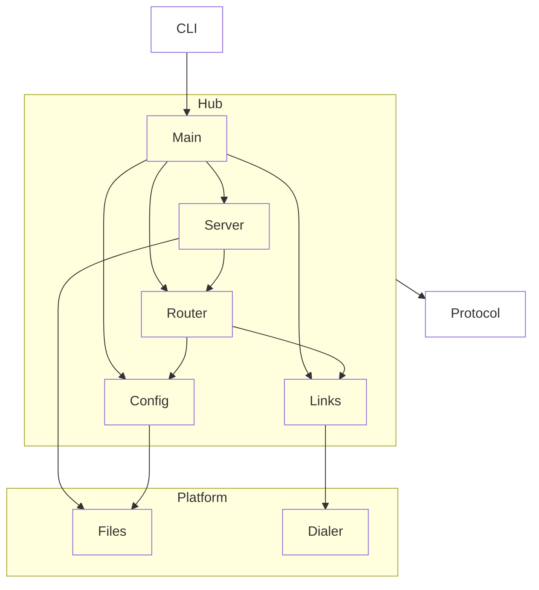

# Hub

## Purpose & context

Local-only gateway. Serves the web bundle and one WebSocket per browser session; per session, holds one link per configured host (local socket or `ssh <host> wtd connect`). Owns `config.json`.

## Building blocks

View `hub`.

<!-- likec4:hub -->

<!-- /likec4:hub -->

## Principles

1. Reaches every daemon, local or remote, only through a link; never imports daemon code. [enforced: arch_check:model-truth]
2. Only `server` faces the browser; only `links` opens daemon connections or spawns processes. [enforced: arch_check:model-truth] [enforced: test:test/architecture/dependencies.test.ts]
3. Binds `127.0.0.1` only; rejects any WebSocket upgrade without the token and matching `Origin` and `Host`. [enforced: test:test/process/hub-server.test.ts]
4. Addresses daemon entities as (host, id) and never rewrites daemon ids. [enforced: test:test/process/hub-router.test.ts]
5. Relays terminal bytes without buffering beyond frames in flight; state other than config lives in daemons. [enforced: test:test/process/hub-router.test.ts]

## Rationale

Acks travel end to end, so bytes in flight through the hub are bounded by the daemon's flow window.
