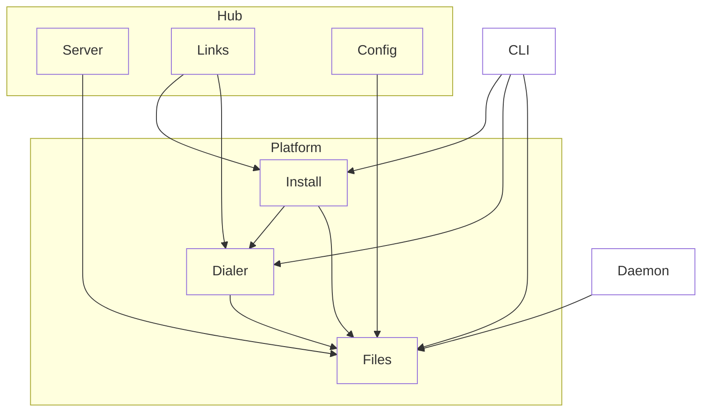

# Platform

## Purpose & context

Node-only infrastructure shared by daemon, hub and CLI: XDG paths and file I/O (`files`); reaching a host's daemon over its socket, with auto-start, or over `ssh` (`dialer`); installing the bundle locally or over `ssh` (`install`).

## Building blocks

View `platform`.

<!-- likec4:platform -->

<!-- /likec4:platform -->

## Principles

1. Knows nothing of protocol, daemon, hub or web. [enforced: arch_check:model-truth]
2. Only `dialer` connects to or spawns a daemon. [enforced: test:test/architecture/dependencies.test.ts]
3. Files and directories it creates are owner-only. [enforced: test:src/platform/files/files.test.ts]
4. File writes are atomic. [enforced: test:src/platform/files/files.test.ts]
