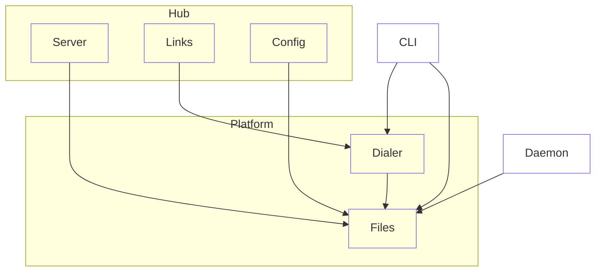

# Platform

## Purpose & context

Node-only infrastructure shared by daemon, hub and CLI: XDG paths and file I/O (`files`); daemon socket connect and auto-start (`dialer`).

## Building blocks

View `platform`.

<!-- likec4:platform -->

<!-- /likec4:platform -->

## Principles

1. Knows nothing of protocol, daemon, hub or web. [enforced: arch_check:model-truth]
2. Only `dialer` connects to or spawns a daemon. [enforced: test:test/architecture/dependencies.test.ts]
3. Files and directories it creates are owner-only. [review]
4. File writes are atomic. [review]
