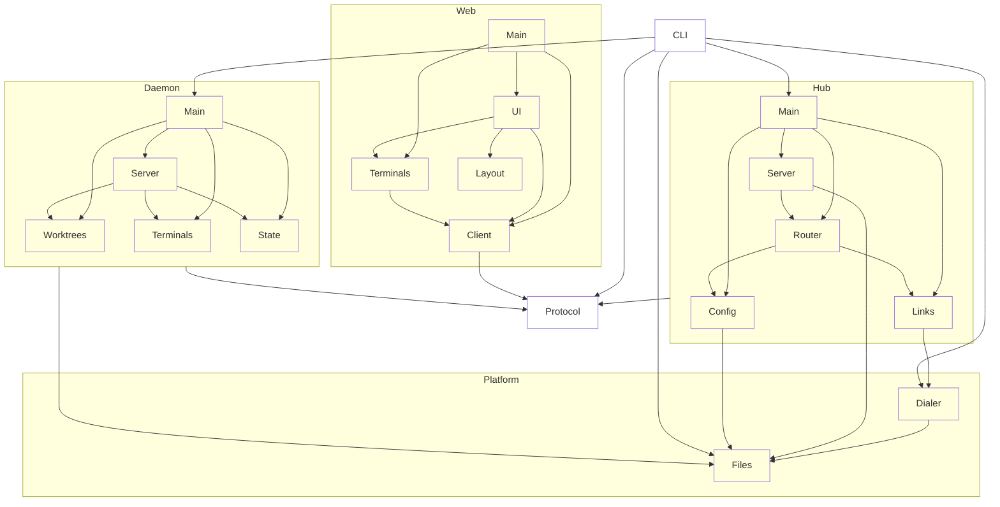

# worktree-term

## Purpose & context

Worktree-centric terminal manager for coding agents. A daemon per host owns PTYs and git watches; a local hub serves the browser UI and reaches every daemon over the protocol (unix socket locally, `ssh <host> wtd connect` remotely).

## Building blocks

View `system`.

<!-- likec4:system -->

<!-- /likec4:system -->

## Principles

1. An import between elements, type-only included, exists only where the model declares the arrow; `protocol` types are importable everywhere. [enforced: arch_check:model-truth] [enforced: test:test/architecture/structure.test.ts]
2. A node with nested elements has no modules of its own; each element exposes only its `index.ts`, and imports of another element target only that file. [enforced: test:test/architecture/structure.test.ts]
3. Third-party packages and I/O-capable Node built-ins are imported only where the element allowlist permits. [enforced: test:test/architecture/dependencies.test.ts]
4. Code passes the strict compiler config and the strict lint config with zero findings; suppressions state a reason. [enforced: test:test/architecture/static.test.ts]
5. Input from outside the process is schema-parsed at the boundary; unparsed data never travels inward. [review]
6. Errors are never swallowed: a catch rethrows, reports, or returns a typed failure. [review]
7. Nothing listens beyond loopback or an owner-only unix socket. [review] [enforced: test:test/process/hub-server.test.ts]
8. Every production change ships with tests in its tier: unit beside the code, `test/process`, `test/e2e`; `test/integration` holds only opt-in real-SSH tests. Mocks are typed against the real module. [review]

## Rationale

The hub is a separate process from every daemon so terminals outlive the UI and local and remote hosts share one code path. The allowlist and `index.ts` rules keep each element's I/O surface and public surface explicit and reviewable.
