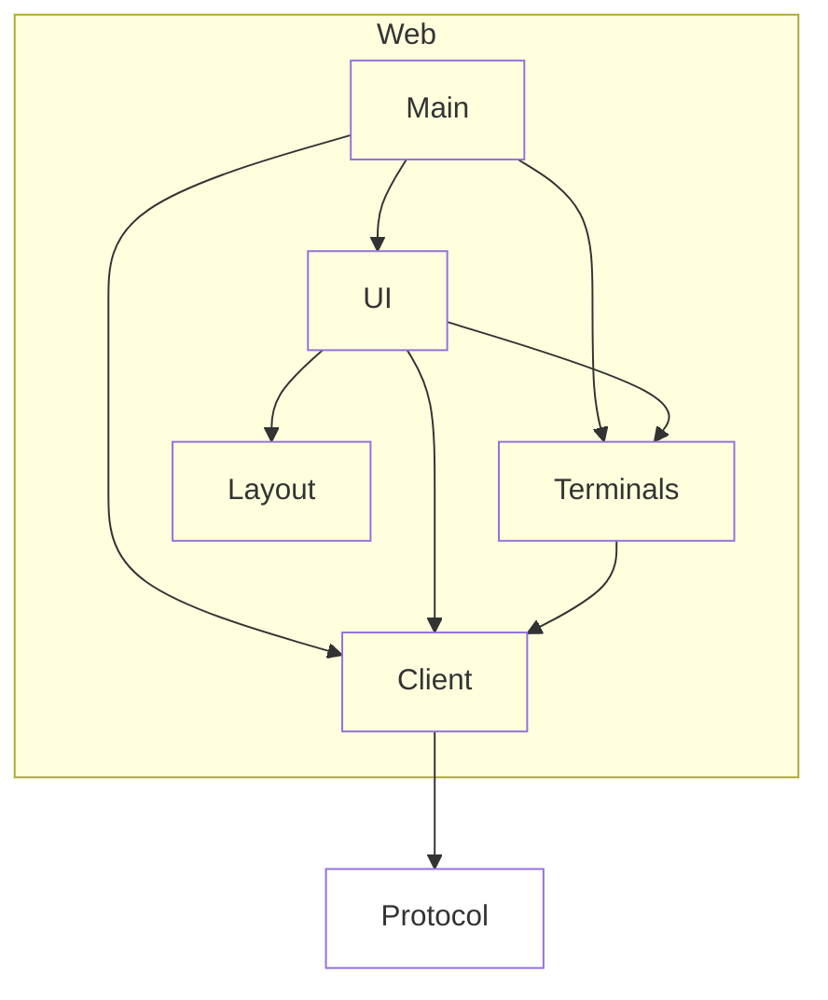

# Web

## Purpose & context

Browser UI served by the hub: repo tabs, worktree sidebar, terminal tabs and splits.

## Building blocks

View `web`.

<!-- likec4:web -->

<!-- /likec4:web -->

## Principles

1. Uses no Node APIs; `layout` is pure. [enforced: test:test/architecture/dependencies.test.ts]
2. Only `client` decodes or encodes wire data. [enforced: arch_check:model-truth]
3. `terminals` never depends on `ui`. [enforced: arch_check:model-truth]
4. A terminal, once created, is never re-created or unmounted while its PTY lives. [review]
5. Switching worktrees performs no network round trip. [review]
6. At most 8 WebGL contexts are live; other terminals render via DOM. [review]
7. Talks only to the hub, over one authenticated WebSocket. [review]
